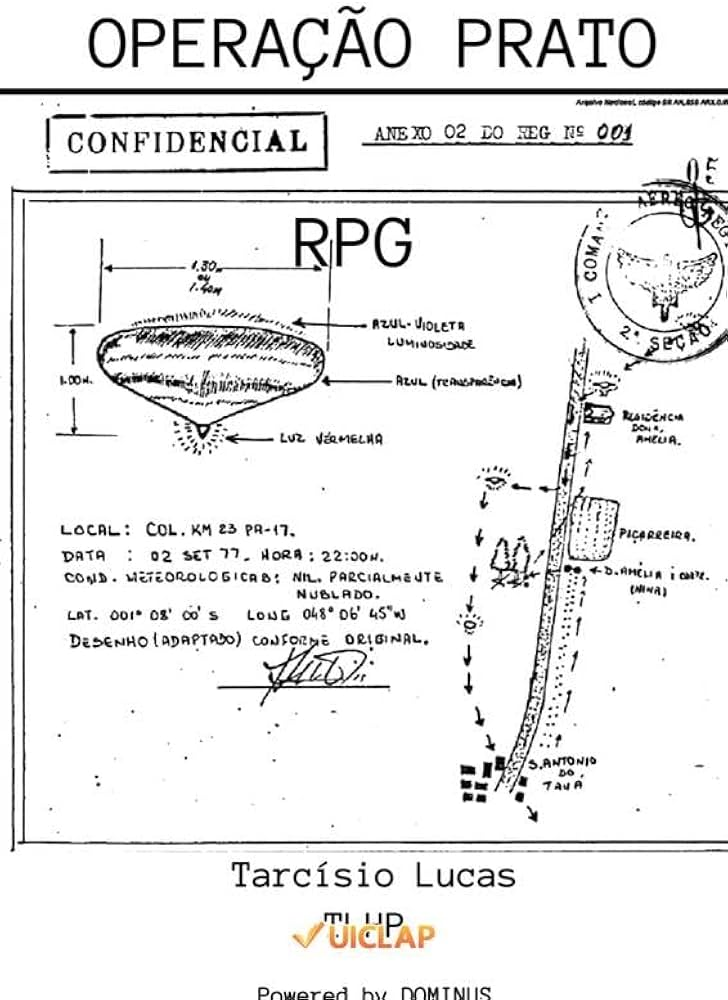
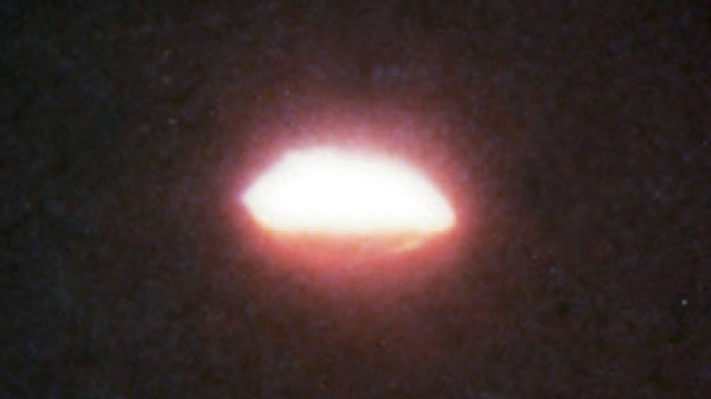

# Operation Saucer / Operação Prato

The *Operação Prato* ("Operation Saucer") was a military investigation conducted by the Brazilian Air Force in 1977 to explore mysterious UFO sightings in the northern region of Brazil, particularly in the state of Pará. The operation took place in the city of Colares, where locals reported strange lights in the sky, which they called *"chupa-chupa"*, meaning "suck-suck." These lights were said to attack people, leaving burns and puncture marks on their skin. Some victims even claimed to have experienced weakness and dizziness after these encounters.

Due to the growing fear among the population, the Brazilian military sent a team of officers, led by Captain Uyrangê Hollanda, to investigate the phenomenon. Over the course of a few months, the team collected testimonies, photographs, and even some videos of the strange lights. Despite the efforts, the military couldn't find any definitive explanations for the sightings.

The official files of *Operação Prato* were kept classified for decades but were eventually declassified in the late 1990s, revealing the extent of the investigation. However, many details of the case remain unexplained, making *Operação Prato* one of Brazil's most famous UFO incidents.

The *chupa-chupa* phenomenon, reported during *Operação Prato*, gave rise to several theories about what these mysterious lights were doing and their potential purpose. Here are the main theories:

### 1. **Extraterrestrial Abductions or Experiments**
One of the most popular theories among UFO enthusiasts is that the *chupa-chupa* lights were related to extraterrestrial beings conducting experiments on humans. The lights were said to target individuals, emitting beams that caused burns and puncture wounds, which some interpreted as evidence of biological testing or energy extraction. Victims reported feeling weak or dizzy afterward, leading to speculation that aliens might have been collecting blood or other biological materials.

### 2. **Energy Extraction**
Another theory suggests that the lights were extracting some form of energy from humans. This idea comes from the reports of people feeling drained, weak, or lethargic after being hit by the light beams. Some believe that these UFOs were using humans as a source of energy, perhaps for survival or to power their technology. This theory is tied to the name *"chupa-chupa,"* which means "suck-suck," implying that the lights were "sucking" something from the victims.

### 3. **Military or Secret Technology Experiments**
Some skeptics of the UFO explanation have proposed that the *chupa-chupa* phenomenon was the result of secret government or military experiments, either Brazilian or from a foreign power. According to this theory, the lights could have been advanced aircraft or drones equipped with experimental weapons or energy beams, testing their effects on humans. This would explain the physical symptoms reported by witnesses without resorting to extraterrestrial explanations.

### 4. **Natural Phenomenon**
Another possible explanation is that the *chupa-chupa* lights were a natural phenomenon, such as ball lightning or some other atmospheric event that science had not yet fully understood. The burns and injuries reported could have been caused by electromagnetic radiation or other natural forces. However, this theory struggles to explain the directed nature of the beams and the consistent pattern of injuries.

### 5. **Mass Hysteria or Psychological Explanation**
A psychological theory suggests that the *chupa-chupa* events could have been a case of mass hysteria or collective fear. As stories of UFO sightings spread, people may have become more sensitive to lights in the sky, interpreting natural or man-made lights as threatening. The psychological stress and fear could have caused people to experience real physical symptoms, even though there was no direct cause. This theory considers the cultural context and the fear that was building among the population at the time.

Each of these theories attempts to explain the *chupa-chupa* phenomenon in different ways, but none have been definitively proven, which is why the case remains mysterious.

## Vocabulary

| English Term         | Portuguese Meaning                |
|----------------------|-----------------------------------|
| Abduction            | Abdução                           |
| Advanced aircraft     | Aeronave avançada                 |
| Beam                  | Feixe de luz                      |
| Biological testing    | Testes biológicos                 |
| Burn                  | Queimadura                        |
| Classified            | Classificado                      |
| Declassified          | Desclassificado                   |
| Energy extraction     | Extração de energia               |
| Injury                | Ferimento                         |
| Light                 | Luz                               |
| Puncture wound        | Ferimento por perfuração          |
| Secret technology     | Tecnologia secreta                |
| UFO                   | OVNI (Objeto Voador Não Identificado) |

## Verbs

| English Verb          | Portuguese Meaning                |
|-----------------------|-----------------------------------|
| Abduct                | Abduzir                           |
| Attack                | Atacar                            |
| Collect               | Coletar                           |
| Conduct               | Conduzir                          |
| Declassify            | Desclassificar                    |
| Drain                 | Drenar, esgotar                   |
| Extract               | Extrair                           |
| Fear                  | Temer                             |
| Investigate           | Investigar                        |
| Report                | Relatar                           |
| Spread                | Espalhar                          |
| Target                | Alvejar                           |

## Expression

| English Expression        | Portuguese Meaning                  |
|---------------------------|-------------------------------------|
| Conduct experiments        | Conduzir experimentos               |
| Collect testimonies        | Coletar depoimentos                 |
| Directed beams of light    | Feixes de luz direcionados          |
| Energy extraction          | Extração de energia                 |
| Fear spreading             | Propagação do medo                  |
| Feeling weak               | Sentir-se fraco                     |
| Gather evidence            | Coletar evidências                  |
| Investigate the phenomenon | Investigar o fenômeno               |
| Mass hysteria              | Histeria coletiva                   |
| Strange lights in the sky  | Luzes estranhas no céu              |
| Target individuals         | Alvejar indivíduos                  |
| Unexplained details        | Detalhes inexplicáveis              |
| Widespread fear            | Medo generalizado                   |

