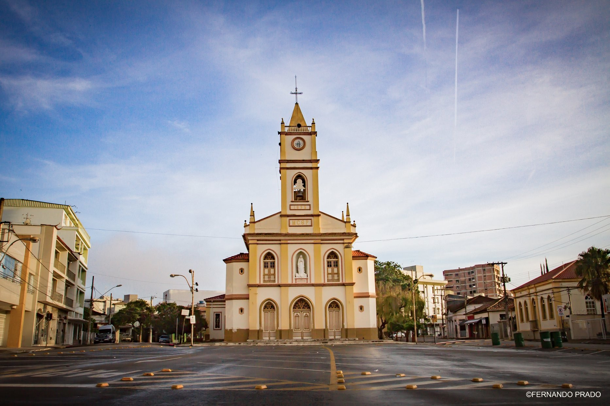
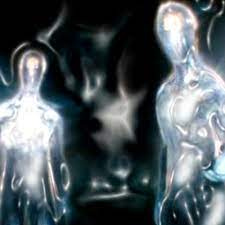
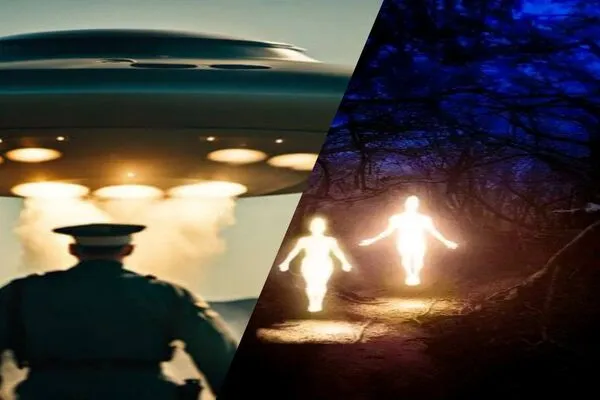

Here is the reformulated text with the occurrences placed in specific years:

# Cláudio/MG

## Mysterious Lights in the Mountains (2024)  
The Cláudio case begins with an intriguing sighting of mysterious lights in the mountains near the small Brazilian town, which became widely reported in 2024. Locals observed these lights flashing across the dark, rugged landscape, far from any known roads or trails. Described as bright, white, and behaving erratically, these lights seemed to blink on and off at random. One moment they would illuminate the mountains, and in the next, they would disappear entirely. Witnesses noted that the lights appeared to move toward fires caused by wildfires, though there were no signs of human presence in those remote areas. Locals attempted to record these lights, but capturing their unpredictable behavior on video proved difficult. Initial theories ranged from drones or local aircraft to something far more mysterious. Some believed the lights were connected to unidentified flying objects (UFOs) and extraterrestrial activities, especially given the long-standing UFO history in Brazil.

## Description of the Beings (2008-2024)  
Following the sightings of the strange lights, starting in 2008 and continuing until 2024, witnesses began reporting encounters with luminous beings. These creatures were described as humanoid in shape but with unusual characteristics that set them apart from any known lifeforms. Their skin glowed with a fluorescent, almost ethereal light, making them stand out against the night sky. In some accounts, the beings appeared headless or with blurred, indistinct facial features, adding to their mysterious and otherworldly presence. Witnesses described seeing these creatures in groups, standing still or moving near the areas where the lights had been observed. The beings were generally seen from a distance and seemed to avoid direct contact with humans. When light was shone on them, they often vanished or faded into the shadows. Their appearance led to speculation about whether these beings were connected to the lights in the mountains and whether they were visiting Earth for a specific purpose.

---

## Possible Abductions and Missing Time (2008-2024)  
As more reports of UFO sightings and encounters with luminous beings surfaced between 2008 and 2024, some locals began to experience something even more unsettling: missing time. Several residents of Cláudio recounted episodes where they could not account for hours, sometimes entire evenings, of their lives. In these cases, individuals would suddenly realize that hours had passed, but they had no memory of what happened during that time. The phenomenon of missing time is often associated with alien abductions, where people are taken aboard extraterrestrial ships without their awareness. Later, they may recall fragments of the experience through dreams or hypnosis. In Cláudio, a few individuals reported dreamlike memories of being in bright, circular rooms with no discernible exit or entrance. These environments, brightly lit and sterile, are consistent with descriptions of alien abduction experiences, where abductees often report undergoing medical or scientific procedures.

## Genetic Changes in Witnesses (2023-2024)  
One of the most unusual and potentially groundbreaking aspects of the Cláudio case is the reports of genetic or physiological changes in some of the individuals who encountered the UFOs or luminous beings. From 2023 to 2024, a number of locals claimed to have experienced significant health improvements following their strange encounters. In particular, some witnesses who had previously suffered from chronic illnesses or frequent sickness began to notice that they no longer fell ill as often. Their immune systems appeared to have been enhanced, leading to speculation that the beings might have conducted genetic experiments or altered their biology in some way. While these reports remain anecdotal, they point to the possibility of extraterrestrial beings having the ability to manipulate human genetics, perhaps as part of a larger experiment. However, without scientific verification, these claims remain a topic of speculation and debate among researchers.

## Discovery of Uranium and Other Minerals (2010-Present)  
Another important aspect of the Cláudio case is the discovery of uranium and other valuable minerals in the region, beginning around 2010. Cláudio is located in an area known for its rich mineral deposits, including uranium, which is often used in nuclear energy and weapons production. The presence of these minerals has led some researchers to believe that the UFOs and extraterrestrial visitors might be drawn to the area because of its geological features. In UFO research, there is a well-documented history of sightings near regions rich in rare minerals, fueling theories that extraterrestrial beings might be interested in Earth's natural resources. Some believe that UFOs may be using these minerals to power their advanced technologies or that they are studying Earth's geology for unknown purposes.

## Connection Between UFO Sightings and Minerals (2010-Present)  
The connection between UFO sightings and mineral-rich areas like Cláudio has led to further speculation about the visitors' intentions, especially since 2010 when uranium deposits were discovered. In many cases worldwide, UFO sightings are often reported near sites where rare minerals or energy resources are found. Some researchers suggest that extraterrestrials might be harvesting these minerals, possibly to power their spacecraft or for use in other unknown technologies. The uranium deposits in the Cláudio area could be of particular interest to these visitors, especially given its importance in nuclear energy. The idea that extraterrestrial beings might be conducting geological studies on Earth or extracting resources adds another layer of complexity to the UFO phenomenon. If true, it raises questions about the long-term goals of these beings and whether they are here as passive observers or active participants in Earth's ecosystem.

## Challenges Faced by Locals in Sharing Experiences (2008-2024)  
Despite the remarkable nature of these sightings and encounters, many locals in Cláudio have been reluctant to share their experiences publicly since the early sightings in 2008. Cláudio is a small, close-knit town, and people fear being ridiculed or ostracized if they talk openly about UFOs or extraterrestrial beings. This reluctance to speak out has made it difficult for researchers to gather detailed information about the encounters, as many witnesses are hesitant to come forward. However, those who have shared their stories describe life-altering experiences, with some believing that the UFOs and beings continue to visit the area regularly. Although the fear of ridicule persists, the sheer number of reports and the consistency of the details have prompted serious investigation by UFO researchers, who believe that Cláudio could become a significant hotspot for UFO activity in Brazil.

## Investigations into Genetic Changes (2023-Present)  
In response to reports of genetic changes among some of the witnesses, beginning in 2023, researchers are starting to explore ways to scientifically verify these claims. This includes gathering medical records from individuals who reported health improvements, performing DNA tests, and looking for any patterns among those who had close encounters with the strange lights and beings. If these changes can be confirmed, it would represent a major breakthrough in UFO research, providing concrete evidence of extraterrestrial influence on human biology. Such a discovery could also shed light on the broader question of why extraterrestrial beings might be visiting Earth and what their long-term objectives might be.

## Conclusion  
The Cláudio UFO case offers a fascinating glimpse into the potential for extraterrestrial contact, abductions, and even genetic experimentation. The discovery of uranium and other valuable minerals in the area adds another layer of intrigue, suggesting that the beings may have a specific interest in Earth's natural resources. While much of the story remains speculative, the consistency of the reports from locals and the strange occurrences in the region provide a rich source of information for researchers. As investigations continue, there is hope that more evidence will emerge, helping to unravel the mystery of these encounters and what they might mean for humanity. For now, Cláudio stands as a unique and important case in the ongoing study of UFOs and extraterrestrial phenomena.

Aqui estão as três tabelas revisadas com o acréscimo do termo "uranium" ao vocabulário:

### Vocabulary

| Word              | Meaning                                      |
|-------------------|----------------------------------------------|
| Sightings         | Observações                                  |
| Encounter         | Encontro                                     |
| Witness           | Testemunha                                   |
| Mysterious        | Misterioso                                   |
| Humanoid          | Humanoide                                    |
| Luminous          | Luminoso                                     |
| Abductions        | Abduções                                     |
| Genetic           | Genético                                     |
| Minerals          | Minerais                                     |
| Uranium           | Urânio                                       |
| Remote            | Remoto                                       |
| Unidentified      | Não identificado                             |
| Physiological     | Fisiológico                                  |
| Research          | Pesquisa                                     |
| Speculation       | Especulação                                  |
| Geological        | Geológico                                    |
| Resources         | Recursos                                     |

### Verbs

| Verb              | Meaning                                      | Conjugation Example                 |
|-------------------|----------------------------------------------|-------------------------------------|
| Observe           | Observar                                     | They observed strange lights.       |
| Describe          | Descrever                                    | Witnesses described the beings.     |
| Encounter         | Encontrar/Deparar-se com                     | They encountered mysterious beings. |
| Illuminate        | Iluminar                                     | The lights illuminated the mountains.|
| Record            | Gravar/Registrar                             | Locals tried to record the lights.  |
| Blink             | Piscar                                       | The lights blinked on and off.      |
| Disappear         | Desaparecer                                  | The beings disappeared when seen.   |
| Speculate         | Especular                                    | People speculated about their origins. |
| Enhance           | Melhorar/Aprimorar                           | Some reported enhanced health.      |
| Harvest           | Colher/Extrair                               | They might be harvesting minerals.  |
| Avoid             | Evitar                                       | The beings avoided contact.         |
| Appear            | Aparecer                                     | The beings appeared glowing.        |
| Conduct           | Conduzir/Realizar                            | They conducted experiments.         |
| Fear              | Temer                                        | Locals feared sharing their experiences.|
| Investigate       | Investigar                                   | Researchers investigated the case.  |

### Expressions

| Expression                    | Meaning                                            | Example                                        |
|-------------------------------|---------------------------------------------------|------------------------------------------------|
| Missing time                   | Tempo perdido (fenômeno onde a pessoa não se lembra de parte do tempo) | Several locals experienced missing time.       |
| Long-standing history          | História de longa data                            | Brazil has a long-standing UFO history.        |
| Life-altering experience       | Experiência transformadora                        | Witnesses described life-altering experiences. |
| Drawing comparisons            | Fazendo comparações                              | The case is drawing comparisons to other UFO cases. |
| Advanced technology            | Tecnologia avançada                              | They might be using advanced technology.       |
| Fueling theories               | Alavancando teorias                               | These discoveries are fueling theories of alien interest. |
| Concrete evidence              | Evidência concreta                                | Researchers hope to find concrete evidence.    |
| Reluctant to share             | Relutante em compartilhar                         | Many locals are reluctant to share their stories. |
| Consistent with descriptions   | Consistente com descrições                        | Their memories are consistent with typical alien encounters. |
| Geological features            | Características geológicas                        | The area’s geological features might attract UFOs. |