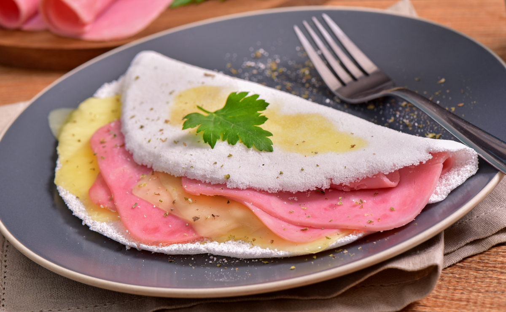
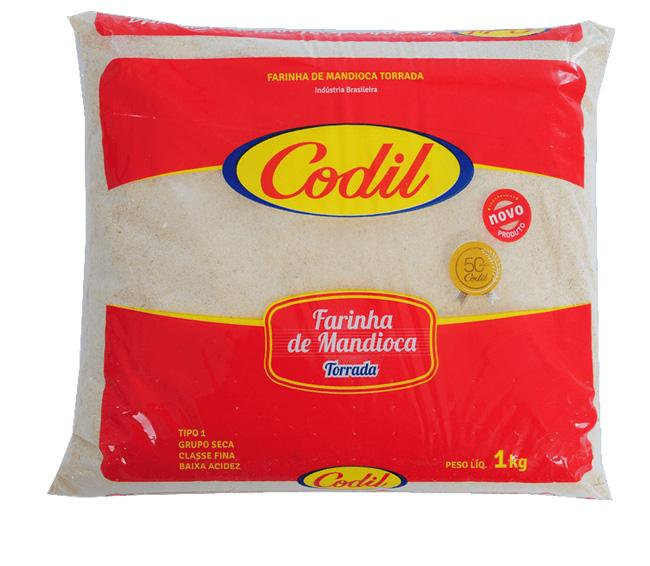

[<< BACK ](foods.md)
# Typical Brazilian Dishes with Cassava

Before exploring the world of cassava-based dishes, it’s important to recognize that this is just one branch of Brazilian cuisine. The country's dishes often include a variety of fruits, seafood, and regional spices, highlighting the rich and varied food culture across Brazil.

Cassava is a versatile and essential root in Brazilian cuisine, used in typical dishes across the country. In the Northeast, it is common to eat boiled cassava with dried meat, a dish that combines the soft texture of cassava with the intense flavor of salted and ***shredded meat***, often served with onions and regional spices. This dish is usually served with *manteiga de garrafa*, a type of clarified liquid butter typical of the Northeast. This butter is made by heating and separating the fat from the whey, resulting in a butter with an intense flavor and a liquid texture. It is stored in bottles and adds extra flavor to regional dishes.

Boiled cassava with meat

Boiled cassava with dried meat and butter

Manteiga de garrafa - liquid butter

## Tapioca

Another Northeast highlight is *tapioca*, made from cassava ***starch*** and served as a kind of pancake that can have sweet or savory fillings. A classic sweet filling is the combination of ***grated*** coconut and condensed milk, which adds a tropical and ***slightly*** sweet taste.

Tapioca with coconut and condensed milk

Tapioca 1

Tapioca 2

Tapioca 3

## Tapimaki (Recent Brazilian Invention)

In Brazil, they invented the idea of ​​using the previous tapioca dough and modifying the Japanese temaki and transforming it into tapimaki.

Temaki

Tapimaki

## Cassava Cake / Bolo de Mandioca

*Bolo de mandioca*, or cassava cake, is a popular dessert in Brazil with a unique texture and flavor. The cake is dense and ***moist***, with a creamy interior and a ***slightly*** ***crispy*** ***crust*** that adds an enjoyable ***crunch*** with every bite. Its flavor is naturally sweet and ***earthy***, highlighting the taste of cassava itself. There are also delicious variations, like bolo de mandioca com goiabada, which includes slices of guava paste that melt into the cake, adding a touch of fruity sweetness. Another popular variation is with requeijão, a creamy Brazilian cheese spread similar to cream cheese, which brings a savory contrast to the sweet cassava base. Both of these ingredients make the cake even richer and offer a ***delightful*** balance of textures and flavors.

Cassava Cake / Bolo de mandioca

Cassava Cake with creamy Brazilian cheese / Bolo de mandioca com Requeijão

Cassava Cake with guava paste / Bolo de mandioca com Goiabada

## Cassava Flour

*Cassava flour*, one of the most popular cassava products, is traditionally used as a side dish with rice and beans, adding a ***crunchy*** texture and special flavor to the meal. At parties and breakfast, cassava cake is a popular sweet, with variations like cassava cake with guava paste, which adds a creamy and slightly ***acidic*** layer to the cake.

Cassava flour

Cassava flour with rice and beans

## Tapioca Cubes, Fried Cassava

*Tapioca cubes*, made from tapioca mixed with cheese and baked, have become famous for their crunchy outside and soft inside. Fried cassava is also popular across the country and served as a side dish or snack, appreciated for its ***crispy*** outside and soft inside texture.

Tapioca cubes

Fried cassava

## Cassava Fritters with Dried Meat

*Bolinho de mandioca com carne seca*, or cassava fritters with dried meat, are another beloved Brazilian treat. These fritters are made by mixing mashed cassava with shredded dried meat, forming the mixture into small balls, and ***deep-frying*** them until golden brown. The result is a deliciously crispy exterior with a savory and tender filling, making them a perfect appetizer or snack.

Bolinho de mandioca com carne seca

## Escondidinho

*Escondidinho* with meat is another dish that features cassava. It is made with a creamy cassava purée mixed with cheese that covers a layer of meat, usually dried meat or ground meat, creating a rich and satisfying flavor combination.

Escondidinho

## Pirão

Besides these, cassava is an ingredient in many other dishes, such as *pirão*. Pirão is made with fish, meat, or chicken broth mixed with cassava flour. Because cassava flour has starch, it ***thickens*** ***the broth***, creating a creamy texture and comforting flavor. Different types of pirão are enjoyed with various meats, making it an ideal companion to main dishes and ***enhancing*** their flavors.

Pirão

## Vaca Atolada and Beiju

Other traditional cassava dishes include *vaca atolada*, a stew of ribs with cassava, and *beiju*, an indigenous delicacy made from pressed and baked cassava dough. These dishes highlight the versatility and cultural importance of cassava, used both in everyday recipes and for special occasions, standing out as a true symbol of Brazilian cuisine.

Vaca atolada

 

Beiju

Another important cassava product is **polvilho**, which is the starch extracted from the root. Sweet *polvilho* is pure dry ***starch***, while ***sour*** *polvilho* is fermented before drying, which gives it a slightly acidic flavor. It is essential in recipes like *pão de queijo* (cheese bread), which uses sweet or sour polvilho to achieve a crispy outside and soft inside, as well as polvilho ***biscuits*** and the traditional *biscoito de vento*, common in various regions of Brazil.

Pão de queijo

Polvilho biscuits

Polvilho biscuits

In nutritional terms, cassava is a source of complex carbohydrates, similar to potatoes and rice, but has a lower glycemic index, which provides a slower and more sustained release of energy. It is rich in fiber, which helps with satiety and digestion. Compared to other carbohydrates, cassava is naturally gluten-free, making it a great option for people with ***dietary*** restrictions. It also contains small amounts of B vitamins and minerals like calcium and potassium, which are essential for bone and muscle health. This makes cassava an energetic and versatile food, suitable for various diets and lifestyles.

---

## Vocabulary Table

| English               | Portuguese             |
|-----------------------|------------------------|
| Shredded meat         | Carne desfiada         |
| Starch                | Amido                  |
| Grated                | Ralado                 |
| Slightly              | Levemente              |
| Moist                 | Úmido                  |
| Crispy crust          | Crocante               |
| Crunch                | Crocância              |
| Earthy                | Terroso                |
| Delightful            | Agradável              |
| Crunchy               | Crocante               |
| Acidic                | Ácido                  |
| Deep-frying           | Fritura                |
| The broth             | O caldo                |
| Enhancing             | Realçando              |
| Sour                  | Azedo                  |
| Biscuits              | Biscoitos              |
| Dietary               | Alimentares            |

## Dish Translation and Description

| Dish Name               | English Translation       | Description                                                                 |
|-------------------------|---------------------------|-----------------------------------------------------------------------------|
| Bolo de mandioca        | Cassava Cake              | A dense and moist cake made from cassava, often with a crispy crust.        |
| Dadinho de tapioca      | Tapioca Cubes             | Baked cubes of tapioca and cheese with a crunchy outside and soft inside.   |
| Tapioca                 | Tapioca                   | A pancake-like dish from cassava starch with sweet or savory fillings.      |
| Vaca atolada            | "Stuck Cow" Stew          | A stew made from ribs and cassava, with a rich, comforting flavor.          |
| Beiju                   | Cassava Flatbread         | Indigenous flatbread made from pressed and baked cassava dough.             |
| Escondidinho            | Hidden Cassava Purée      | Cassava purée with a layer of meat, usually dried meat or ground beef.      |
| Pirão                   | Thickened Cassava Broth   | Broth made from fish, meat, or chicken thickened with cassava flour.        |
| Pão de queijo           | Cheese Bread              | Cheese bread made with cassava starch, soft inside and crispy outside.      |
| Polvilho Biscoito       | Cassava Starch Biscuit    | Light and airy biscuits made from cassava starch, usually crispy.           |
