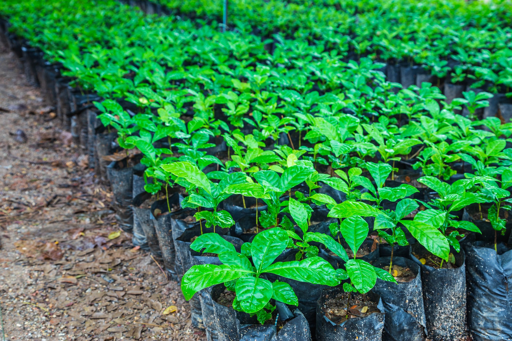
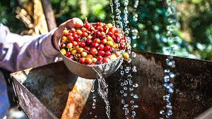
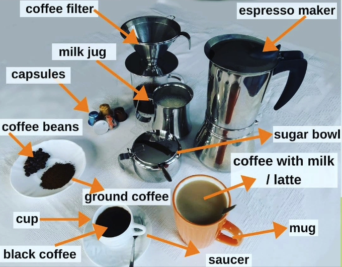
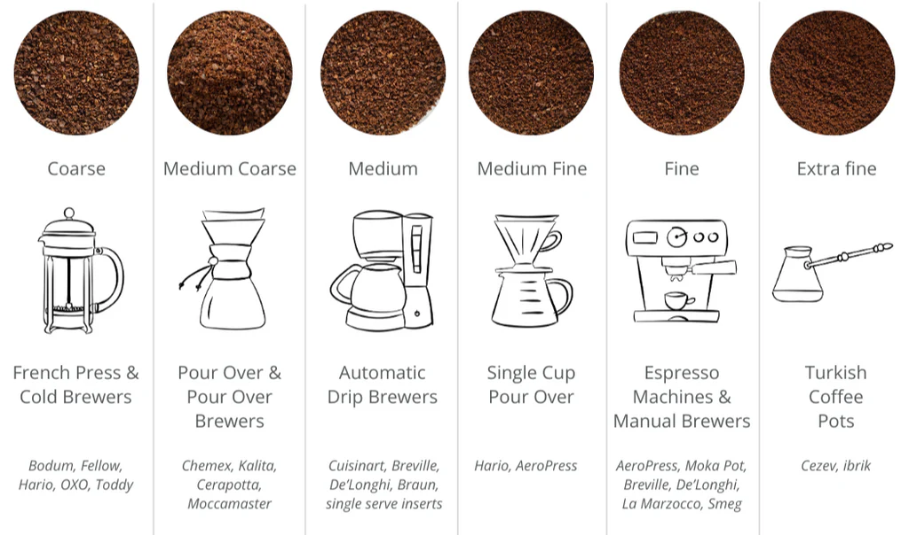

[<< BACK ](README.md)

# COFFEE

## TABLE OF CONTENTS

- [1 - History of Coffee and Production](#1---history-of-coffee-and-production)
- [2 - Introduction to Coffee and Coffee Equipment](#2---introduction-to-coffee-and-coffee-equipment)
- [3 - Article: How to Grind Coffee Beans Like a Pro](#3---article-how-to-grind-coffee-beans-like-a-pro)

## 1 - HISTORY OF COFFEE AND PRODUCTION

The story of coffee dates back centuries, with its origins believed to be in the **Ethiopian highlands**. According to legend, a goat herder named **Kaldi** noticed that his goats became very energetic after eating berries from a certain tree. Kaldi shared his discovery with local monks, who then used the berries to stay awake during long hours of prayer. Eventually, word spread to the Arabian Peninsula, and coffee became a part of daily life in the Middle East, North Africa, and later Europe.

---

### Coffee Farming: From Seed to Harvest

Coffee production begins on **coffee farms** where the coffee plant (*Coffea arabica* or *Coffea canephora*, known as *robusta*) is grown. Let’s break down the process:

### 1. **Planting**
   - Coffee grows best in tropical climates with plenty of rain and stable temperatures. Farmers plant coffee seeds in **nurseries** and later transplant the young plants to their fields.
   - **Irrigation** systems are often used to ensure the coffee plants receive sufficient water, especially during dry seasons.

### 2. **Growth and Cultivation**
   - Coffee plants take 3 to 4 years to mature and begin producing fruit, known as **coffee cherries**. During this time, the plants need careful attention, including regular watering and pruning.
   - Farmers monitor the weather and seasonal changes, ensuring the plants get the right balance of sunlight and water.

### 3. **Harvesting**
   - Once the coffee cherries are ripe (typically turning red), the **harvest** begins. Harvesting is often done by hand to ensure that only the ripe cherries are picked, although in some larger farms, machines may be used.
   - The timing of the **harvest season** is crucial, as harvesting too early or too late can affect the quality of the beans.

### 4. **Processing the Coffee Cherries**
   - After harvesting, coffee cherries must be processed to extract the beans inside. There are two main methods:
     - **Dry processing**: The cherries are laid out in the sun to dry naturally.
     - **Wet processing**: The cherries are washed, and the pulp is removed before the beans are dried.
   - The processing method greatly impacts the flavor of the coffee.

### 5. **Sorting and Grading**
   - Once processed, the beans are sorted and graded according to size, shape, and quality. Different **lots** are created, and higher-quality beans are often sold at a premium.
   - Beans are inspected and tested to ensure they meet quality standards before being shipped.

### 6. **Exporting**
   - Coffee beans are a major export product for many countries. After grading, the beans are packaged and shipped to markets around the world. This step, known as **exportation**, is crucial for the economies of coffee-producing countries.
   - The **profit** generated from coffee sales is important for the livelihoods of many farmers.

### 7. **Roasting and Selling**
   - Once the beans are exported, they are **roasted** to develop their flavor. Roasting can be done on a small scale or in large factories, depending on the demand. After roasting, coffee is packaged and sold to consumers.

---

### Important Vocabulary for Coffee Production

| **Word**               | **Explanation**                                                 | **Translation**                   |
|------------------------|-----------------------------------------------------------------|-----------------------------------|
| **Cherries**           | The fruit of the coffee plant, which contains the coffee beans. | **Cerejas** (de café)             |
| **Crop**               | A cultivated plant grown on a large scale, like coffee.         | **Safra/Colheita**                |
| **Exportation**        | The process of shipping goods to another country.               | **Exportação**                    |
| **Farmer**             | A person who grows crops, in this case, coffee.                 | **Agricultor**                    |
| **Graded**             | The process of sorting coffee beans based on quality and size.  | **Classificado**                  |
| **Harvest**            | The process of gathering ripe crops from the fields.            | **Colheita/Safra**                |
| **Irrigation**         | The method of supplying water to plants using artificial means. | **Irrigação**                     |
| **Lot**                | A portion or batch of a product, used for grading coffee beans. | **Lote**                          |
| **Mill**               | A facility where coffee cherries are processed to extract the beans. | **Moinho**                      |
| **Nursery**            | A place where young plants are grown before being planted.      | **Viveiro**                       |
| **Processing**         | The method of turning coffee cherries into beans.               | **Processamento**                 |
| **Production**         | The entire process of growing, harvesting, and processing.      | **Produção**                      |
| **Profit**             | The financial gain made from selling coffee.                    | **Lucro**                         |
| **Pruning**            | Cutting back branches to encourage healthy growth in plants.    | **Poda**                          |
| **Pulp**               | The outer layer of the coffee cherry that is removed during processing. | **Polpa**                    |
| **Roasting**           | The process of heating coffee beans to develop flavor.          | **Torrefação**                    |
| **Ripe**               | The state of being fully matured, ready for harvest.            | **Maduro**                        |
| **Seasons**            | Times of the year affecting growth and harvest, e.g., wet season.| **Estação do ano**                |
| **Shade-grown**        | Coffee grown under the canopy of trees, protecting it from direct sunlight. | **Café cultivado à sombra**  |
| **Watering**           | The act of providing water to plants, often through irrigation. | **Regar**                         |

---

### Coffee Production Verbs and Tenses

| **Verb**         | **Past Tense**   | **Present Tense** | **Future Tense** | **Translation**         |
|------------------|------------------|-------------------|------------------|-------------------------|
| **Plant**        | Planted          | Plant             | Will plant       | **Plantar**             |
| **Grow**         | Grew             | Grow              | Will grow        | **Crescer**             |
| **Harvest**      | Harvested        | Harvest           | Will harvest     | **Colher**              |
| **Irrigate**     | Irrigated        | Irrigate          | Will irrigate    | **Irrigar**             |
| **Export**       | Exported         | Export            | Will export      | **Exportar**            |
| **Roast**        | Roasted          | Roast             | Will roast       | **Torrar**              |
| **Process**      | Processed        | Process           | Will process     | **Processar**           |
| **Sort**         | Sorted           | Sort              | Will sort        | **Classificar**         |
| **Prune**        | Pruned           | Prune             | Will prune       | **Podar**               |

---

### Key Expressions

| **Expression**                     | **Meaning**                                                     | **Translation**                   |
|------------------------------------|-----------------------------------------------------------------|-----------------------------------|
| **“Coffee production begins with…”** | A common phrase to describe the start of the coffee process.     | **"A produção de café começa com..."** |
| **“Harvest season”**               | Refers to the time when crops are ready to be picked.            | **"Temporada de colheita"**       |
| **“The profit from coffee sales”** | Describes the financial gain after selling the coffee.           | **"O lucro das vendas de café"**  |
| **“Coffee is a major export product”** | Indicates that coffee is an important item shipped abroad.      | **"O café é um produto de exportação importante"** |
| **“Processing the coffee cherries”**| Refers to the steps taken to extract the coffee beans.           | **"Processamento das cerejas de café"** |

---

## 2 - INTRODUCTION TO COFFEE AND COFFEE EQUIPMENT

1. **Coffee Filter**  
   - **Purpose:** A coffee filter is used to separate the coffee grounds from the brewed liquid. In a pour-over method, water is poured over the grounds, and the filter prevents the grounds from entering the cup while allowing the brewed coffee to pass through.
   
2. **Espresso Maker**  
   - **Purpose:** This is a stovetop espresso maker, also known as a "Moka pot." It uses steam pressure to force water through finely-ground coffee, brewing a strong and concentrated coffee similar to espresso.

3. **Milk Jug**  
   - **Purpose:** The milk jug is used to hold and pour milk, especially when making drinks like a latte or cappuccino. In some cases, it's used to froth milk using a steam wand or a frothing tool.

4. **Capsules**  
   - **Purpose:** Coffee capsules or pods are pre-packaged portions of ground coffee. They are used in specific coffee machines that brew coffee by piercing the capsule and forcing hot water through it.

5. **Coffee Beans**  
   - **Purpose:** Coffee beans are the seeds of the coffee plant and the foundation for any coffee drink. These are roasted and ground before brewing. Whole beans are preferred by many because they maintain their flavor longer than pre-ground coffee.

6. **Ground Coffee**  
   - **Purpose:** This is coffee that has already been ground from beans. Ground coffee is ready to be used in various brewing methods such as drip coffee makers, French presses, or espresso machines.

7. **Sugar Bowl**  
   - **Purpose:** A small container used to store sugar, which can be added to coffee to sweeten it. Many people enjoy a bit of sugar to balance the bitterness of coffee.

8. **Coffee with Milk / Latte**  
   - **Purpose:** This refers to a coffee drink that combines coffee with steamed milk. A latte typically has more milk than coffee and is smooth and creamy.

9. **Cup**  
   - **Purpose:** A small cup used to serve coffee, often for a shot of espresso or a black coffee.

10. **Black Coffee**  
    - **Purpose:** This is coffee served without any additives like milk or sugar. It’s strong and retains the natural bitterness and flavor of the coffee beans.

11. **Mug**  
    - **Purpose:** A larger cup, typically used for serving coffee with milk or larger portions of black coffee. Mugs are often used for casual, everyday coffee drinking.

12. **Saucer**  
    - **Purpose:** A small dish placed under the coffee cup to catch any spills and to hold a spoon or small snack that might accompany the coffee.

13. **Coffee Powder (Ground Coffee):** This is the final product after grinding coffee beans. The fineness of the grind depends on the brewing method; espresso machines use fine grounds, while French presses require coarse grounds. The freshness of the ground coffee plays a huge role in the flavor and aroma of the brewed coffee.

---

### **Quick Vocabulary Recap**

- **Coffee Filter:** Separates grounds from liquid coffee.
- **Espresso Maker:** Stovetop tool to make strong, concentrated coffee.
- **Milk Jug:** Used for pouring or frothing milk.
- **Capsules:** Pre-packed coffee portions for specific machines.
- **Coffee Beans:** The raw, roasted beans used to make coffee.
- **Ground Coffee:** Coffee that has already been ground, ready to brew.
- **Sugar Bowl:** Stores sugar for sweetening coffee.
- **Coffee with Milk / Latte:** Coffee drink with steamed milk.
- **Cup:** Small serving vessel for coffee.
- **Black Coffee:** Coffee without milk or sugar.
- **Mug:** Larger cup for coffee, often for casual drinking.
- **Saucer:** Small dish that accompanies the cup to catch spills.
- **Coffee Grounds (Pó de Café):** Ground coffee used to brew.

---

### **Brewing Methods**

There are different brewing methods for preparing coffee, and each method pairs well with a particular grind size. Here are a few examples:

- **Espresso Maker (Moka Pot):** Requires finely ground coffee.
- **Pour Over (using a Coffee Filter):** Works best with medium-coarse to medium-fine grind.
- **Capsule Machines:** Use pre-ground coffee packed into capsules.
- **French Press:** Uses coarsely ground coffee to steep in hot water.

---

## 3 - ARTICLE: HOW TO GRIND COFFEE BEANS LIKE A PRO

Sipping a delicious cup of coffee in the morning is a delightful ritual for most Americans. From the first whiff of fresh coffee beans wafting from the package to the sounds of your percolator, single-serve, or drip brewer, making coffee is a comforting way to start the day.

Among U.S. households that consume coffee, only 20% use whole bean coffee at least some of the time. This means that most coffee drinkers buy and prepare ground coffee at home. Buying your coffee ground certainly saves time and energy when you're on the go, but learning how to properly grind coffee beans at home can make a big difference in the flavor and textures you experience.

---

### Why Does Grind Size Matter?

Grinding whole bean coffee right before you brew it ensures maximum freshness and flavor. Roasted coffee contains volatile oils that impart most of the flavors you taste when you consume coffee. Once beans are ground, these oils react with oxygen and evaporate. The longer your ground coffee is exposed to the air, the more flavor it may lose.

Additionally, how water interacts with your coffee during brewing profoundly affects taste and mouthfeel. Your grind size and texture are important because the more contact water has with the coffee during brewing, the quicker it will be extracted. You could accidentally prevent extraction if your grind is too fine for your brewing method.

If your grind is too coarse, water may move through your coffee too quickly and produce a weak, tasteless cup. In other words, over-ground or too fine coffee can be over-extracted during brewing and result in a bitter taste. Coffee that is under-ground or too coarse can be under-extracted during brewing and result in watery, weak, or sour-tasting coffee.

---

### Grind Sizes

Learning how to grind coffee beans like a pro requires an understanding of the different sizes, textures, and brewing methods you can use to prepare coffee. Now that you know why grinding coffee beans matters, here are the most common names and sizes of grinds you can try at home.

- **Whole bean coffee** is not a type of grind per se, but it is essential to know the term. Whole bean refers to un-ground coffee and is the best choice for fresh coffee prepared at home.
- **Coarse grind** is best for immersion brewing methods where water has a lot of contact with the coffee while brewing. A coarse grind should have the texture of gritty and granular grains you can see with the naked eye. Compare to sea salt crystals.
- **Medium coarse** is slightly more refined than a coarse grind used for French Press and immersion brewing and is a great choice for large pour-over brewers like the Chemex, Moccamaster, and Kalita.
- **Medium** is the best grind size for automatic drip brewers and the most common size you'll find at the grocery store or on the shelf at your corner coffee shop. Medium grinds work best in automatic home brewers and should resemble the size and texture of fine beach sand or flaky sea salt.
- **Medium fine** is a fine grind for single-cup brewers like a Hario pour-over or traditional AeroPress.
- **Fine** is the perfect grind size for espresso machines and manual espresso brewers like a Moka Pot or inverted AeroPress.
- **Extra fine** is a powdery grind used for making Turkish coffee. The consistency should resemble all-purpose flour or baker's cocoa powder.

---

### Brewing Methods

Now that you are familiar with some of the most common names and sizes of grinds, it's time to pair them with your favorite brewing method like an expert.

- **Immersion brewing** includes methods such as French Press, percolator, and coffee cupping. During immersion brewing, ground coffee has contact with the water for an extended time, so a coarse or medium-coarse grind is most effective and flavorful.
- **Drip brewing** is the most popular brew method in the U.S. and includes automatic drip and single-serve machines. Use a medium grind for electric brewing methods, and you'll have a delicious and quick cup.
- **Pour Over** includes Hario pour-over, Chemex, and other cone-filtered methods where water is poured by hand over the ground coffee. Manual brewing gives you more flexibility and room to experiment and determine what you like since you control water flow. Try a medium coarse grind for multi-cup brewers like the Chemex or a medium-fine grind for single-cup pour-overs like the Hario or traditional AeroPress.
- **Pressure extraction brewing** includes espresso brewing and AeroPress methods. Pressure extraction forces hot water through tightly packed and finely ground coffee to produce a robust shot with a silky layer of foam on top, known as crema. Use a fine grind to get that straight-from-the-barista flavor and texture.
- **Cold brewing coffee** is slightly different since there is no heat to expedite the brewing process. Because cold brewing coffee takes up to 8 hours, it is important to use a coarse grind that resembles cracked peppercorns.
- **Turkish coffee** combines extra finely ground coffee with sugar, water, and spices, boiling it in a small pot. An extra-fine grind is essential because Turkish coffee is served unfiltered.

---

### At-Home Machines for Grinding Beans

You're well on your way to mastering the art of grinding coffee beans and becoming a grind guru. Now it's time to discuss the different grinders you can purchase for your home. There are four main types of grinders to look for and compare.

- **Blade grinders** are the most common type of home coffee grinder you can find at a kitchen equipment store near you. They feature a simple blade at the bottom of the vessel and a few speed settings. Blade grinders are best for coarse to medium grinds because their limited speed settings and single blade can deliver inconsistent results.
- **Burr grinders** are the preferred home grinders for many at-home coffee aficionados. Their multi-blade system creates more surfaces for coffee bean crushing, which results in a more even and consistent grind.
- **Conical burr grinders** are professional-grade grinders you see at your local cafe. Their conical shape and multiple speed settings provide the most accurate grind sizes and textures.
- **Hand grinders** are great for gourmet coffee on the go or making sure you can still prep your morning cup when the power goes out. Hand grinders used to be the most common at-home bean grinding machines but have become less common with the advent of electric grinders.

---

### How to Grind Coffee Beans Without a Grinder

If you're ready to experiment with coffee grinds but not quite prepared to invest in an at-home grinder, there are many ways to test your technique and taste with the tools you already have.

- Use a **blender** to experiment with coarse and medium grinds at home. The simple blades and low-speed setting should give you decent results.
- Use a **mortar and pestle** to get a consistent medium-fine to fine grind. It will take some time and elbow grease, but you should get excellent results.
- Use a **food processor** to pulse beans to your desired texture. Try grinding a small amount (about 1/2 cup) of whole beans at a time for more consistent results.
- Several other kitchen tools, from rolling pins to meat tenderizers and kitchen knives, can be used to chop, crush, and grind. Experiment and have fun!

---

### Vocabulary Table

| **Word/Expression**         | **Explanation in English**                                                                                      | **Meaning in Portuguese**                                                |
|-----------------------------|-----------------------------------------------------------------------------------------------------------------|-------------------------------------------------------------------------|
| **Sipping**                 | Drinking something slowly to enjoy its taste.                                                                   | **Saboreando**; beber algo lentamente para apreciar o sabor.            |
| **Whiff**                   | A slight smell of something.                                                                                    | **Cheiro**; uma leve sensação de cheiro de algo.                        |
| **Wafting**                 | Moving gently through the air.                                                                                  | **Flutuando**; movendo-se suavemente pelo ar.                           |
| **Percolator**              | A type of coffee pot in which boiling water is cycled through coffee grounds.                                   | **Percolador**; cafeteira onde a água fervente circula pelo café moído. |
| **Drip brewer**             | A coffee maker where water drips through coffee grounds by gravity.                                             | **Cafeteira de gotejamento**; água goteja através do café moído.        |
| **Ritual**                  | A sequence of activities performed regularly, especially as part of a routine.                                   | **Ritual**; sequência de atividades realizadas regularmente.            |
| **Whole bean coffee**       | Coffee beans that have not been ground.                                                                         | **Café em grãos**; café que ainda não foi moído.                        |
| **Ground coffee**           | Coffee beans that have been ground into small particles.                                                        | **Café moído**; grãos de café que foram moídos.                         |
| **On the go**               | While moving or during a journey; busy or active.                                                               | **Em movimento**; enquanto se está ocupado ou ativo.                    |
| **Blitz**                   | To grind or process quickly.                                                                                    | **Triturar rapidamente**; processar rapidamente.                        |
| **Flavor**                  | The distinctive taste of a food or drink.                                                                       | **Sabor**; gosto característico de um alimento ou bebida.               |
| **Texture**                 | The feel, appearance, or consistency of a surface or substance.                                                 | **Textura**; sensação ou consistência de uma superfície ou substância.  |
| **Grind size**              | The size of coffee particles after grinding, affecting brewing and flavor.                                      | **Tamanho da moagem**; tamanho das partículas de café após moer.        |
| **Volatile oils**           | Oils that evaporate quickly and carry aroma and flavor.                                                         | **Óleos voláteis**; óleos que evaporam rapidamente e carregam aroma e sabor. |
| **Evaporate**               | To turn from liquid into vapor; to disappear.                                                                   | **Evaporar**; transformar-se de líquido em vapor; desaparecer.          |
| **Mouthfeel**               | The sensation created in the mouth by a particular food or drink.                                               | **Sensação na boca**; sensação criada na boca por um alimento ou bebida.|
| **Extraction**              | The process of removing flavors from coffee grounds during brewing.                                             | **Extração**; processo de retirar sabores do café moído durante a infusão. |
| **Over-extracted**          | Coffee that has had too much flavor drawn out, often tasting bitter.                                            | **Superextraído**; café com extração excessiva, resultando em amargor.  |
| **Under-extracted**         | Coffee that hasn't had enough flavor drawn out, often tasting weak or sour.                                     | **Subextraído**; café com extração insuficiente, resultando em sabor fraco ou azedo. |
| **Immersion brewing**       | Brewing method where coffee grounds are steeped in water for an extended period.                                | **Infusão por imersão**; método onde o café fica mergulhado na água por um tempo prolongado. |
| **French Press**            | A coffee brewing device where coffee grounds are steeped and then filtered by pressing a plunger.               | **Prensa Francesa**; dispositivo onde o café é mergulhado e filtrado com um êmbolo. |
| **Pour Over**               | Manual brewing method where water is poured over coffee grounds in a filter.                                    | **Método de filtragem manual**; água é vertida sobre o café em um filtro. |
| **Pressure extraction**     | Brewing method where water is forced through coffee grounds under pressure, like in espresso machines.          | **Extração sob pressão**; água é forçada através do café sob pressão.   |
| **Crema**                   | The light-colored foam on top of an espresso shot.                                                              | **Crema**; espuma clara no topo de um café expresso.                    |
| **Cold brewing**            | Brewing coffee with cold water over an extended period.                                                         | **Infusão a frio**; preparar café com água fria por um longo período.   |
| **Turkish coffee**          | A method of brewing very finely ground coffee unfiltered, often with sugar.                                     | **Café turco**; método de preparo com café moído muito fino e não filtrado. |
| **Blade grinder**           | Grinder that uses blades to chop coffee beans.                                                                  | **Moedor de lâminas**; usa lâminas para cortar os grãos de café.        |
| **Burr grinder**            | Grinder that uses two abrasive surfaces to grind coffee beans uniformly.                                        | **Moedor de rebarbas**; usa duas superfícies abrasivas para moer o café uniformemente. |
| **Conical burr grinder**    | A type of burr grinder with conical-shaped burrs for precise grinding.                                          | **Moedor cônico de rebarbas**; moedor com rebarbas cônicas para moagem precisa. |
| **Hand grinder**            | Manual coffee grinder operated by hand.                                                                         | **Moedor manual**; moedor de café operado manualmente.                  |
| **Elbow grease**            | Effort or hard physical work, especially when doing manual tasks.                                               | **Esforço físico**; trabalho braçal ou esforço manual.                  |
| **Pulse**                   | To operate a machine in short bursts.                                                                           | **Pulsar**; operar uma máquina em breves intervalos.                    |
| **Scant**                   | Barely sufficient or adequate; minimal amount.                                                                  | **Escasso**; quantidade mínima ou insuficiente.                         |
| **Cuppa**                   | Informal term for a cup of tea or coffee.                                                                      | **Xícara**; termo informal para uma xícara de chá ou café.              |
| **Granular**                | Composed of small grains or particles.                                                                          | **Granulado**; composto de pequenos grãos ou partículas.                |
| **Gritty**                  | Having a rough texture.                                                                                         | **Arenoso**; com textura áspera.                                        |
| **Flaky sea salt**          | Sea salt that comes in thin flakes.                                                                             | **Sal marinho em flocos**; sal do mar em finos flocos.                  |
| **All-purpose flour**       | Common type of flour used in cooking, finely ground.                                                            | **Farinha de trigo comum**; tipo de farinha fina usada na culinária.    |
| **Expedite**                | To make something happen sooner or more quickly.                                                                | **Acelerar**; fazer algo acontecer mais rápido.                         |
| **Cracked peppercorns**     | Peppercorns that have been coarsely crushed.                                                                    | **Pimenta quebrada**; grãos de pimenta grosseiramente triturados.       |
| **Unfiltered**              | Not passed through a filter; containing all particles.                                                          | **Não filtrado**; sem passar por filtro; contendo todas as partículas.  |
| **Aficionado**              | A person who is very knowledgeable and enthusiastic about an activity.                                          | **Aficionado**; pessoa entusiasta e conhecedora de uma atividade.       |
| **Consistency**             | Uniformity or evenness in texture or performance.                                                               | **Consistência**; uniformidade em textura ou desempenho.                |
| **Robust**                  | Strong and rich in flavor or smell.                                                                             | **Robusto**; forte e rico em sabor ou aroma.                            |
| **Silky**                   | Smooth and soft in texture.                                                                                     | **Sedoso**; suave e macio na textura.                                   |
| **Elaborate**               | Involving many carefully arranged parts or details; detailed and complicated.                                   | **Elaborado**; envolvendo muitos detalhes; detalhado e complexo.        |
| **Meat tenderizer**         | A tool used to soften meat by breaking down the fibers.                                                         | **Amaciador de carne**; ferramenta usada para amaciar a carne.          |
| **Experiment**              | To try out new ideas or methods to discover something.                                                         | **Experimentar**; testar novas ideias ou métodos para descobrir algo.   |

---

### Verbs from the Text

| **Verb**        | **Explanation in English**                                 | **Meaning in Portuguese**                             |
|-----------------|------------------------------------------------------------|-------------------------------------------------------|
| **Sip**         | To drink slowly, taking small mouthfuls.                   | **Beber em pequenos goles**; saborear lentamente.     |
| **Waft**        | To pass or cause to pass gently through the air.           | **Flutuar**; mover-se ou fazer mover-se suavemente pelo ar. |
| **Grind**       | To reduce something to small particles by crushing it.     | **Moer**; reduzir algo a pequenas partículas esmagando-o. |
| **Brew**        | To make coffee or tea by mixing it with hot water.         | **Preparar**; fazer café ou chá misturando com água quente. |
| **Impart**      | To give or bestow a quality to something.                  | **Conferir**; dar ou conceder uma qualidade a algo.   |
| **Evaporate**   | To turn from liquid into vapor; to disappear.              | **Evaporar**; transformar-se de líquido em vapor; desaparecer. |
| **Interact**    | To act in such a way as to have an effect on another.      | **Interagir**; agir de modo a afetar outro.           |
| **Prevent**     | To stop something from happening.                          | **Prevenir**; impedir que algo aconteça.              |
| **Extract**     | To remove or take out, especially by effort or force.      | **Extrair**; remover ou retirar, especialmente com esforço. |
| **Steep**       | To soak in water or other liquid to extract flavor.        | **Infusionar**; mergulhar em água para extrair sabor. |
| **Pulse**       | To operate a machine in short bursts for processing.       | **Pulsar**; operar uma máquina em breves intervalos.  |
| **Chop**        | To cut into pieces with repeated sharp blows.              | **Picar**; cortar em pedaços com golpes repetidos.    |
| **Crush**       | To press or squeeze forcefully to break or deform.         | **Esmagar**; pressionar ou apertar com força para quebrar. |
| **Experiment**  | To try out new ideas or methods.                           | **Experimentar**; testar novas ideias ou métodos.     |

---

### Example Sentences

- "She enjoys **sipping** her coffee slowly in the morning."
- "The aroma of freshly ground coffee **wafted** through the kitchen."
- "You should **grind** the beans just before brewing to maximize flavor."
- "If you grind the coffee too fine for your brewing method, it can **prevent** proper **extraction**."
- "He decided to **experiment** with different grind sizes to find his perfect cup."

## Conclusion and Final Notes

Coffee is much more than a drink—it's a global journey that begins on farms and ends in your cup, with countless hands involved in planting, harvesting, processing, and roasting. Whether you enjoy a simple black coffee or a complex espresso, understanding the steps of coffee production and how to grind your beans properly enhances your appreciation for the beverage. 

Next time you brew a cup, take a moment to think about the effort that goes into producing each sip. From **planting the seed** to **exporting the beans**, every part of the process plays a role in creating the flavors you love.

---

## Song Suggestion

[“To Sweet”](https://open.spotify.com/track/5oCyK3vuoQWzczWNwabnL9?si=gbCunPEaR4SPYtanCd03Fw)

---

## References

- Kauai Coffee Company. **Find Your Grind: How to Grind Coffee Beans Like a Pro**. [Kauai Coffee Blog](https://kauaicoffee.com/blogs/news/find-your-grind-how-to-grind-coffee-beans-like-a-pro). Accessed September 2024.