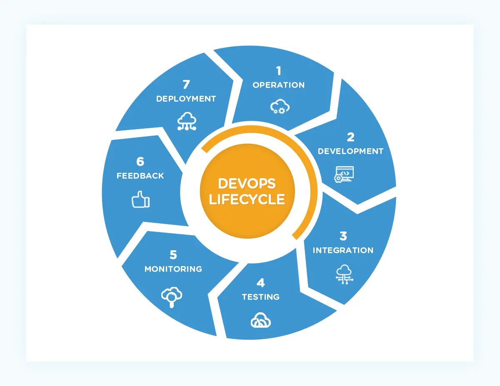

# DevOps

## Overview
DevOps is a software development methodology that emphasizes communication between development and operations teams. By fostering collaboration and automating processes, DevOps aims to improve speed, efficiency, and quality in the software lifecycle, making it ideal for large-scale projects. Historically, development and operations were siloed, leading to miscommunication and delays. DevOps integrates both, reducing these issues through a continuous, iterative process that shares responsibilities between teams.

## Key Phases of the DevOps Lifecycle

1. **Plan**: Focuses on planning the project lifecycle with an iterative approach, incorporating feedback from previous cycles.
2. **Code**: Developers write code based on the plan, ensuring compatibility with project operations.
3. **Build**: The code is integrated into the project, often through tools like GitHub, and prepared for the next stages.
4. **Test**: Teams test the code for bugs and edge cases to ensure functionality.
5. **Release**: After verifying the code, it's approved for production.
6. **Deploy**: The code is moved to the production environment, a shared responsibility between Dev and Ops teams.
7. **Operate**: The software is used in production, and its performance informs future development cycles.
8. **Monitor**: Feedback from users and performance monitoring guide the next iteration.

## The 7 C’s of DevOps
1. **Continuous Development**: Focuses on project planning and coding, breaking down objectives into smaller tasks.
2. **Continuous Integration**: Integrates new code and features continuously, ensuring frequent testing.
3. **Continuous Testing**: Ongoing testing to catch errors, often using automation tools like Selenium.
4. **Continuous Deployment**: Automates the deployment process to ensure smooth, consistent updates.
5. **Continuous Feedback**: Gathers and analyzes feedback to improve future releases.
6. **Continuous Monitoring**: Regularly monitors application performance and addresses issues.
7. **Continuous Operations**: Minimizes downtime through automated updates and maintenance using tools like Kubernetes and Docker.