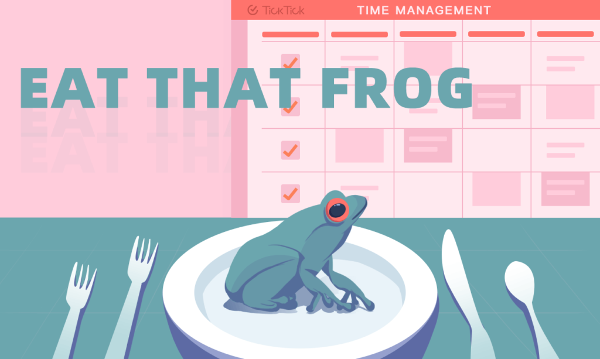

# Eat the Frog Method By Ruri Ohama Youtube Channel
 
One of the most well-known productivity tips is the "Eat the Frog" method, which comes from a quote by Mark Twain: 

> "If it's your job to eat a frog, it's best to do it first thing in the morning. And if it's your job to eat two frogs, it's best to eat the biggest one first."

This essentially means that the hardest or most important task of the day should be tackled first. Once you accomplish that difficult task, the rest of the day’s tasks will feel easier, and you’re more likely to have a productive day. The logic is that after overcoming the biggest challenge, everything else will seem more manageable.

## References

- Ruri Ohama. **Watch this if you always procrastinate**. [Ruri Ohama](https://www.youtube.com/watch?v=sYi5kaUVdco&t=762s). Accessed October 2024.

---

# Eat That Frog: The Most Practical Productivity Method You Should Know

## Table of Contents
1. [What does “Eat That Frog” mean?](#what-does-eat-that-frog-mean)
2. [Advantages and Limits](#advantages-and-limits)
3. [How to Eat Your Frog](#how-to-eat-your-frog)
4. [Time to Execute on It!](#time-to-execute-on-it)

---

Many of us enjoy making plans, such as spending hours creating a never-ending to-do list. Similar to registering for a gym membership but never visiting, the common reaction to a redundant list or a big commitment is usually:
- Procrastinate on it till the last minute;
- Start with small and low-value tasks to feel like they are still progressing.

Maybe everyone procrastinates, and for most of the time, procrastination indeed damages our productivity and success. However, not all procrastination is harmful. High performers differ from low performers by choosing the right tasks to procrastinate on. They intentionally put off those not-so-important tasks and first focus on dealing with the task that has the highest priority. This refers to a productivity approach called **"Eat That Frog."**

## What does “Eat That Frog” mean?

Don’t be scared away by the strange term, as it’s not asking you to eat a real frog. Metaphorically, “Frog” here stands for the hardest and most important task that you’re most likely to leave until the last minute. **“Eat That Frog”** means doing that task first thing in the morning, putting it right at the top of your schedule. Start your workday with it and persist until the task is completed before moving on to anything else.

The origin of "Eat That Frog" is said to be attributed to a quote from Mark Twain:
> “If it’s your job to eat a frog, it’s best to do it first thing in the morning. And if it’s your job to eat two frogs, it’s best to eat the biggest one first.”

Brian Tracy further described and developed it as a productivity method in his book *Eat That Frog!: 21 Great Ways to Stop Procrastinating and Get More Done in Less Time*. In this book, he introduces 21 practical ways to "eat that frog," incorporating other productivity methods like **Time Blocking** and the **Pareto Principle**.

## Advantages and Limits

### Advantages

#### 1. It Reduces Mental Suffering from Procrastination
High achievers focus on completing top-priority tasks first, which can alleviate the negative effects of procrastination. By finishing the most important task, we avoid mental stress caused by delaying critical work. This can include guilt, anxiety about time, and fear of potential consequences. Completing the big task early also triggers endorphins and dopamine, making us happier and more motivated.

#### 2. It Enhances Focus for the Whole Day
Eating the frog first in the morning helps enhance focus throughout the day. If you leave the most difficult task for later, your day will be filled with stress and worry about that task. Completing the top-priority task early clears your mind and allows you to focus better on the remaining tasks.

#### 3. It Boosts Productivity
Your productivity can increase significantly by eating the frog in the morning. In addition to improving focus, you're also using your peak energy levels to tackle difficult tasks. Achieving success with the hardest task gives you a sense of accomplishment that can propel you through the rest of the day.

#### 4. It Propels Goal-Reaching in the Long Run
The "frog" represents tasks that move you closer to your goals. According to the **Pareto Principle**, 20% of actions determine 80% of the results. By completing key tasks first, you make significant progress towards your long-term goals.

### Limits

Despite its strengths, this method might not be flexible when priorities shift. In real life, new urgent tasks can arise, which can interfere with your original “frog.” A potential solution is to only focus on one frog at a time, and if multiple frogs exist, prioritize the most important one.

## How to Eat Your Frog

While "Eat That Frog" seems easy on paper, it needs to be combined with other productivity techniques like **Time Blocking** and the **Eisenhower Matrix** to maximize effectiveness.

### 1. Find the Frog
The first step is identifying your frog, which means determining the most important and mentally demanding task. According to the **Eisenhower Matrix**, tasks are categorized by urgency and importance:
- Urgent and Important
- Urgent but Not Important
- Important but Not Urgent
- Neither Important nor Urgent

The **urgent and important** tasks are the "frogs" that should be marked as high-priority. Avoid having too many top priorities, as too many priorities dilute their importance.

**Tip**: If you use a task manager like TickTick, set High Priority to your frogs and pin them at the top of your list.

### 2. Make Plans
It’s always recommended to identify your frog for the next day at the end of today’s work. For example, closing all irrelevant browser tabs and leaving only the one related to tomorrow’s frog helps you start your day with focus.

Time-block your tasks for the day. As Brian Tracy suggests, “Organize your days around large blocks of time where you can concentrate on extended periods on your most important tasks.” Scheduling tasks on your calendar, and giving your frog the highest priority, will help you stay committed. 

If your frog is too big to complete in one go, divide it into smaller frogs for different days. Use the **Subtask** feature in TickTick to break it down into manageable steps, each with its own priority.

## Time to Execute on It!
Now that you understand the concept, it's time to apply the **Eat That Frog** method to your daily routine. Identify your frog, make a plan, and tackle it first thing in the morning. Your productivity, focus, and overall success are bound to improve!

- Tick Tick. **Eat That Frog: The Most Practical Productivity Method You Should Know**. [Tick Tick](https://blog.ticktick.com/2020/11/20/eat-that-frog-productivity-method/). Accessed October 2024.
