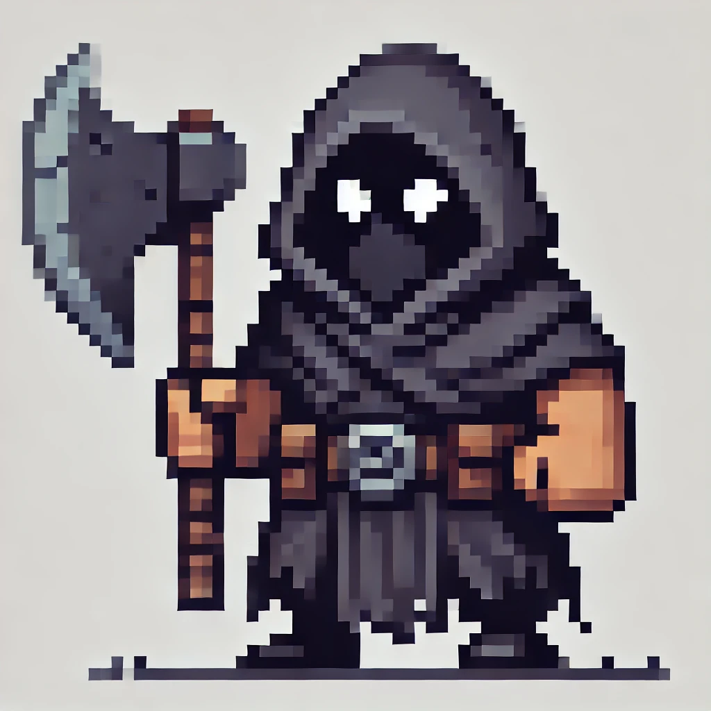

# GAMES

## 1 - RPG Game

### 1. Characters

|  | Name     | Portuguese)  | Example                   |
|--------|-------------------|-----------------------|-------------------------------------------|
|  | Knight             | Cavaleiro             | The knight defended the kingdom with honor. |
|  | Warrior            | Guerreiro             | The warrior fought bravely against the orcs. |
|  | Executioner        | Carrasco              | The executioner raised his axe high.     |
|  | Mage               | Mago                  | The mage summoned a fireball.            |
|  | Clergyman             | Sacerdote             | The clergyman prayed for protection.        |
|  | Priest    | Padre                 | The medieval priest blessed the village. |
|  | Merchant           | Mercador/Comerciante  | The merchant sold rare items.            |
|  | Gnome              | Gnomo                 | The gnome was small but clever.          |
|  | Dwarf              | Anão                  | The dwarf wielded his hammer in battle.  |
|  | Witch              | Bruxa                 | The witch creates potions.  |
|  | Adventurers              | Aventureiros                 | The group of adventurers set out on a thrilling journey to explore the mysterious dungeon.  |

---

### 2. Locais

| Imagem | Nome (Inglês)     | Tradução (Português)   | Exemplo de uso (Inglês)                   |
|--------|-------------------|------------------------|-------------------------------------------|
|  | Dungeon           | Calabouço              | The adventurers entered the dark dungeon. |
|  | Medieval War Camp     | Acampamento de Guerra medieval   | The soldiers rested at the medieval camp. |
|  | Castle            | Castelo                | The castle was surrounded by a moat.      |
|  | Kingdom           | Reinado                | The kingdom flourished under the new king / The kingdom prospered under the rule of a wise and just king. |
|  | Cave              | Caverna                | The treasure was hidden deep inside the cave. |
|  | Sacred Temple / Sanctuary  / Shrine  | Templo Sagrado         | The sacred temple was filled with ancient relics. |
|  | Portal            | Portal                | The heroes gathered at the tavern.        |
|  | Tavern            | Taverna                | The heroes gathered at the tavern.        |
|  | Banquet           | Banquete               | A grand banquet was held for the victory. |

---

### 3. Criaturas

| Imagem | Nome (Inglês)     | Tradução (Português)   | Exemplo de uso (Inglês)                   |
|--------|-------------------|------------------------|-------------------------------------------|
|  | Creature         | Criatura/Monstro        | The creature roared as it attacked the village. |
|  | 3-Headed Dragon  | Dragão de três cabeças  | The three-headed dragon breathed fire.    |
|  | Fairy            | Fada                   | The fairy granted him a wish.             |
|  | Cursed Forest    | Floresta amaldiçoada    | The cursed forest was filled with dark magic. |

---

### 4. Objetos e Itens

| Imagem | Nome (Inglês)     | Tradução (Português)   | Exemplo de uso (Inglês)                   |
|--------|-------------------|------------------------|-------------------------------------------|
|  | Treasure Chest    | Baú de tesouro         | The treasure chest was filled with gold.  |
|  | Health Potion     | Poção de saúde         | The warrior drank the health potion.      |
|  | Magic Potion      | Poção mágica           | The magic potion restored his mana.       |
|  | Stamina Potion    | Poção de stamina       | The athlete drank a stamina potion.       |
|  | Cauldron          | Caldeirão de bruxa     | The witch stirred her pot in the cauldron.|
|  | Medallion         | Medalhão               | The medallion granted him strength.       |
|  | Crown             | Coroa                  | The king wore a golden crown.             |
|  | Ruby              | Pedra preciosa         | The ruby sparkled in the sunlight.        |
|  | Health Container  | Container de saúde     | He found a health container to restore his life. |
|  | Inventory Box     | Caixa de inventário    | The inventory box was filled with potions. |
|  | Map               | Mapa                   | The map showed the way to the dungeon.    |

---

### 5. Armas

| Imagem | Nome (Inglês)     | Tradução (Português)   | Exemplo de uso (Inglês)                   |
|--------|-------------------|------------------------|-------------------------------------------|
|  | Wizard's Magic Hat | Chapéu mágico de bruxo | The wizard cast a spell with his magic hat. |
|  | Magic Wand         | Varinha mágica        | The mage used a powerful spell with the magic wand. |
|  | Sword            | Espada                 | The knight swung his sword.               |
|  | Axe              | Machado                | The executioner wielded a heavy axe.      |
|  | Double-Bladed Axe | Machado de duas lâminas| The warrior swung his double-bladed axe.  |
|  | Spear            | Lança                  | The guard held a spear.                   |
|  | Trident          | Tridente               | The sea god carried a mighty trident.     |
|  | Shield           | Escudo                 | The knight raised his shield for protection. |
|  | Bow and Arrow    | Arco e flecha          | The archer fired an arrow from his bow.   |
|  | Crossbow         | Besta (arma)           | The soldier aimed his crossbow.           |
|  | Magic Staff      | Cetro mágico           | The wizard's magic staff glowed with power. |
|  | Archer           | Arqueiro               | The archer took aim from the tower.       |

Estas tabelas organizam os itens de forma clara, deixando espaço para você adicionar as imagens. Se precisar de ajustes ou mais categorias, estou à disposição!