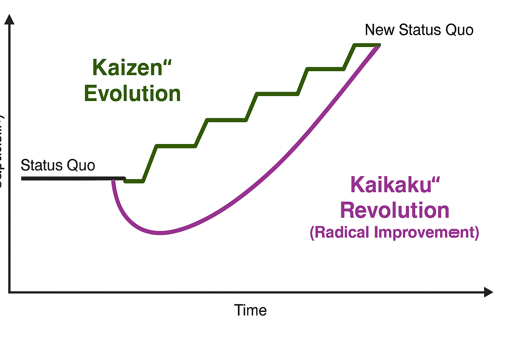
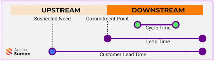
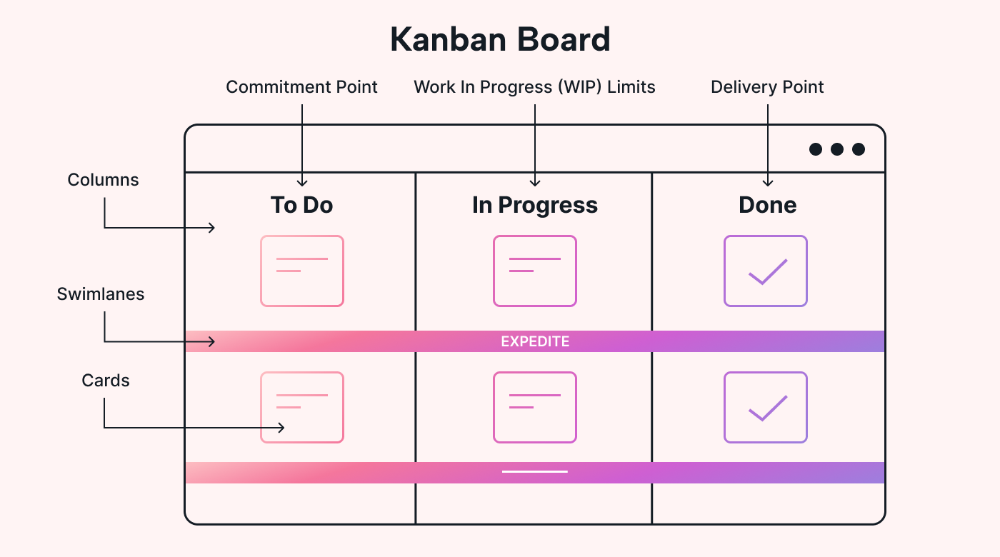

# KANBAN

## 1. Introduction

Today, we’re going to explore Kanban — a visual method that helps teams work better and smarter. You’ll learn where it comes from, what the key ideas are, and how it’s used in real-life software projects.

## 2. Historical Background

### 2.1 The Ford Model – Early 1900s (2 min)

Let's start with the beginning of mass production. In the early 1900s, Henry Ford introduced the assembly line. His idea was to make cars affordable for everyone. Each worker repeated the same task, and the cars moved down the line.

It was a big success in terms of speed and cost. But the system had major problems:

- It created too much inventory (extra parts, unfinished cars)  
- It was inflexible — changing the system was hard  
- It couldn’t adapt to custom orders or quick changes  

In this system, people worked fast, but not always smart. Waste, overproduction, and defects were common.

### 2.2 Toyota Production System – 1940s–1980s (3 min)

After World War II, Japan needed a more efficient way to produce with fewer resources. Toyota engineers, including Taiichi Ohno and Shigeo Shingo, studied American methods but wanted something better.

One inspiration came from supermarkets in the U.S. Customers only take what they need, and shelves are restocked just in time. This inspired the idea of Just-In-Time production — producing only when there's a clear demand.

To make this system work, Toyota created a visual signaling system called Kanban. Each Kanban card represented a request to move or produce a part. When a part was used, a card signaled it was time to make more.

This created a pull system instead of a push system. Workers didn’t build more until it was needed. The result: less inventory, better quality, faster delivery, and continuous feedback.

Kanban means ‘signboard’ or ‘visual signal’ in Japanese — it was literally a communication tool between steps in the process.

### 2.3 From Manufacturing to Knowledge Work – 2000s (1 min)

In the 2000s, businesses realized that manufacturing principles could help in knowledge work — like IT, customer service, and software.

In 2007, David J. Anderson introduced the Kanban Method for software development. Instead of physical parts, teams now used Kanban to manage tasks, like coding features, writing tests, or fixing bugs.

The goal remained the same: deliver value continuously, reduce waste, and improve flow — but now in a digital environment.

## 3. Japanese Concepts (4 min)

Kanban is not just a tool. It reflects deep Japanese philosophies about work.

### 3.1 Kaizen – Continuous Improvement

Kaizen means 'change for better' — it’s the culture of continuous improvement through small, daily changes.

It’s not about big revolutions, but little steps: fixing bugs earlier, communicating better, reviewing processes weekly.

**Example:**

A team notices delays during testing. Instead of blaming someone, they run a retrospective, improve their testing process, and reduce future delays. That’s Kaizen in action.

### 3.2 The 3 M’s: Muda, Mura, Muri

These are the three enemies of efficiency in the Toyota Production System:

- **Muda** – Waste (anything that doesn’t add value, like rework or waiting time)  
- **Mura** – Unevenness (unbalanced workloads or irregular delivery)  
- **Muri** – Overburden (too much pressure on people or equipment)  

Kanban helps us visualize and reduce these problems.

**Example:**

If one developer is overloaded and others are idle — that’s Mura and Muri. If we build features that nobody uses — that’s Muda.

## 4. Key Concepts & Practical Examples (7 min)

### 4.1 The Kanban Board

The most visible part of Kanban is the board. It helps teams see their work at a glance.

Typical columns:

- **To Do** – new tasks  
- **In Progress** – being worked on  
- **Done** – completed  

**Example:**

A marketing team is preparing a campaign. One task: ‘Write blog post’ starts in 'To Do'. A writer moves it to ‘In Progress’, and when it’s reviewed and published, it goes to ‘Done’.

### 4.2 Lead Time vs Cycle Time

| Term        | Definition                                 | Example                                           |
|-------------|--------------------------------------------|---------------------------------------------------|
| Lead Time   | Total time from request to delivery        | Task requested on Monday, delivered Friday = 5 days |
| Cycle Time  | Time from when work begins to completion   | Work starts Wednesday, finishes Friday = 3 days   |

Lead Time shows how long the customer waits. Cycle Time shows how long the team works.

**Practical use:**

Teams track these times to see if they're getting faster. If the Cycle Time keeps growing, it’s a sign of a bottleneck.

### 4.3 WIP Limits (Work in Progress Limits)

WIP limits tell teams not to start too much at once. It improves focus, reduces multitasking, and prevents burnout.

**Example:**

If the limit for 'In Progress' is 3 tasks, and it’s full, no one can start a new task until one is finished. This keeps the team focused.

### 4.4 Flow & Bottlenecks

Kanban is about creating a smooth, continuous flow of work.

If tasks keep piling up in one column — that’s a bottleneck. The board helps you see the problem and fix it.

**Example:**

If QA (testing) always has 10 tasks and developers only 2, maybe testing is under-resourced — time to adjust the process.

## 5. Kanban in Software Teams (2 min)

Modern software teams use Kanban to organize their work visually, limit tasks in progress, and improve over time.

Popular tools: Trello, Jira, Azure DevOps — all allow teams to use Kanban boards online.

Kanban helps teams:

- Focus on priorities  
- Deliver continuously  
- Reduce delays and chaos  
- Improve every sprint or release  

**Example:**

A software team uses Kanban to manage features, bugs, and tech debt. Every Friday, they check the board and look for improvements — that’s modern Kaizen.

## 6. Upstream & Downstream Work (2 min)

In Kanban, we often divide work into two parts: Upstream and Downstream.

### 6.1 Upstream Work

This is all the work that happens before the team starts building the solution.

It includes:

- Gathering ideas  
- Understanding the problem  
- Prioritizing tasks  
- Writing user stories  
- Analyzing requirements  

**Goal:** Decide what is the right thing to work on.

**Example:**

In software, upstream includes writing specs, discussing with the product owner, and deciding if a feature is really needed.

### 6.2 Downstream Work

This is the work that starts after the team decides to build something.

It includes:

- Development  
- Code review  
- Testing  
- Deployment  
- Delivery to users  

**Goal:** Build and deliver the thing in the best way.

**Example:**

Downstream starts when a developer picks a task from the board and ends when the product is live.

## 7. Swimlanes and Classes of Service (2 min)

Kanban is flexible — it allows teams to organize work in different ways. One common way is using **Swimlanes** and **Classes of Service**.

### 7.1 Swimlanes

**Swimlanes** are horizontal rows in a Kanban board that group different types of work. They help teams separate tasks by team, type, or priority.

**Common uses:**
- Separate work by **team** (e.g., Development vs QA)
- Separate work by **urgency** (e.g., Normal tasks vs Critical bugs)
- Separate by **project** or **client**

**Example:**

A board has three swimlanes:
- Top lane: Feature development  
- Middle lane: Maintenance work  
- Bottom lane: Urgent issues  

This makes it easy to see what kind of work is in progress.

---

### 7.2 Class of Service

**Class of Service** defines how work items are treated based on their **urgency** and **business need**. Each class has different expectations and rules.

#### Main Classes of Service:

- **Standard**: Most tasks fall here. They follow normal process, first in, first out.
- **Expedite**: Critical items that need to skip the line and be finished fast.
- **Fixed Date**: Tasks that must be done **before a specific date**.
- **Intangible**: Low-urgency tasks that are still important for long-term quality (like technical debt).

**Example:**

A customer-reported bug that blocks a payment process may be labeled as **Expedite** — it jumps the queue and is worked on immediately.

---

### 7.3 Why It Matters

Using Swimlanes and Classes of Service helps teams:

- Prioritize work more clearly  
- Align work types with different workflows  
- Make urgent work visible without losing track of normal tasks  
