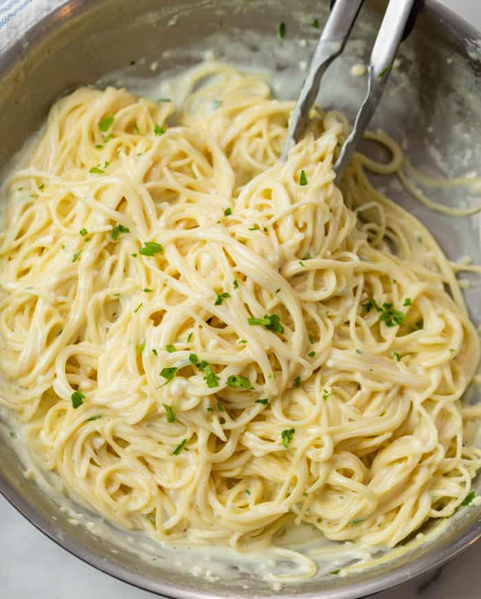

[<< BACK ](foods.md)

# Creamy Garlic Parmesan Pasta: A Step-by-Step Lesson in English

**Objective:** Learn how to make a delicious creamy garlic parmesan pasta. This guide will take you through each step, from preparing the ingredients to cooking the pasta and finishing it with a rich sauce.

---

## Ingredients

### For the Pasta:
- 250g of fettuccine or spaghetti
- Salt (for boiling the pasta)
- 1 tablespoon of olive oil

### For the Sauce:
- 2 tablespoons of butter
- 4 cloves of garlic, minced
- 1 cup (240ml) of heavy cream
- 1 cup (100g) of grated parmesan cheese
- Salt and pepper to taste
- Fresh parsley, chopped (for garnish)

---

## Step-by-Step Instructions

### 1. Prepare the Pasta

- **Boil Water**: Fill a large pot with water, add a generous amount of salt (this adds flavor to the pasta), and bring it to a boil over high heat.
- **Cook the Pasta**: Add the pasta to the boiling water and cook according to the package instructions, usually about 8-10 minutes, until al dente (slightly firm to the bite).
- **Drain the Pasta**: Drain the cooked pasta in a colander and drizzle a small amount of olive oil over it to prevent sticking. Set aside while you prepare the sauce.

### 2. Make the Sauce

- **Melt the Butter**: In a large skillet, melt the butter over medium heat.
- **Sauté the Garlic**: Add the minced garlic to the butter and sauté for about 1 minute, stirring constantly to avoid burning. The garlic should become fragrant but not brown.
- **Add the Cream**: Pour the heavy cream into the skillet and stir well. Let it simmer for about 5-7 minutes, stirring occasionally until it thickens slightly.
- **Add the Parmesan Cheese**: Gradually add the grated parmesan cheese, stirring until the cheese melts and the sauce becomes smooth and creamy. Season with salt and pepper to taste.

### 3. Combine Pasta and Sauce

- **Add the Pasta to the Sauce**: Place the cooked pasta in the skillet with the sauce. Toss the pasta gently to coat it evenly in the creamy garlic parmesan sauce.
- **Simmer**: Allow the pasta to simmer in the sauce for another 2-3 minutes to let the flavors blend and the sauce thicken slightly.

### 4. Serve

- **Plate the Pasta**: Serve the pasta in individual bowls or on a large serving plate.
- **Garnish**: Sprinkle chopped parsley over the top for a fresh finish.

---

## Texture, Smell, and Taste of the Pasta

### **Texture**
The pasta should be creamy and slightly rich in texture, with each strand coated evenly in the sauce. The al dente pasta gives a slight firmness that contrasts nicely with the smooth sauce.

### **Smell**
The dish has a wonderful aroma of garlic and parmesan, with a hint of butter. The smell is inviting and savory, setting the stage for a delicious meal.

### **Taste**
This pasta is rich, creamy, and full of flavor. The garlic adds a slightly sharp, aromatic taste that balances well with the mildness of the cream. The parmesan cheese adds a nutty, savory depth, making each bite comforting and satisfying.

---

## Vocabulary

| Word               | Translation           |
|--------------------|-----------------------|
| Pasta              | Macarrão              |
| Salt               | Sal                   |
| Olive oil          | Azeite de oliva       |
| Butter             | Manteiga              |
| Garlic             | Alho                  |
| Heavy cream        | Creme de leite fresco |
| Parmesan cheese    | Queijo parmesão       |
| Parsley            | Salsa                 |
| Skillet            | Frigideira            |
| Sauce              | Molho                 |

---

## Useful Expressions

| Expression                         | Translation                               |
|------------------------------------|-------------------------------------------|
| Bring to a boil                    | Leve para ferver                          |
| Add a generous amount of salt      | Adicione uma quantidade generosa de sal   |
| Drain the pasta                    | Escorra o macarrão                        |
| Sauté the garlic                   | Refogue o alho                            |
| Let it simmer                      | Deixe ferver em fogo baixo                |
| Add the grated cheese              | Adicione o queijo ralado                  |
| Season with salt and pepper        | Tempere com sal e pimenta                 |
| Garnish with chopped parsley       | Decore com salsa picada                   |
| Serve the pasta                    | Sirva o macarrão                          |
| Coat it evenly                     | Envolva de forma homogênea               |

---

## Verbs

| Verb             | Past Tense       | Translation       |
|------------------|------------------|-------------------|
| Boil             | Boiled           | Ferver           |
| Cook             | Cooked           | Cozinhar         |
| Drain            | Drained          | Escorrer         |
| Melt             | Melted           | Derreter         |
| Sauté            | Sautéed          | Refogar          |
| Stir             | Stirred          | Mexer            |
| Add              | Added            | Adicionar        |
| Pour             | Poured           | Despejar         |
| Simmer           | Simmered         | Cozinhar em fogo baixo |
| Toss             | Tossed           | Misturar levemente|
| Garnish          | Garnished        | Decorar          |

Enjoy making and savoring this delicious creamy garlic parmesan pasta! This dish is perfect for a quick, satisfying meal, and it’s sure to be a crowd-pleaser.